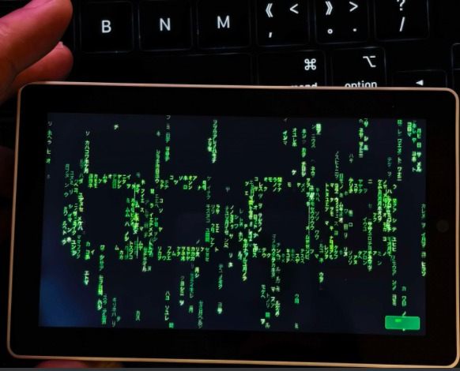

# Matrix Rain Clock — M5Stack Tab5

**English** · [中文](README_CN.md)

**Digital rain on a 5-inch MIPI-DSI panel: 80 columns of falling glyphs, a 7-segment clock the rain refracts through, and a WiFi provisioning wizard you drive with your finger.**

**5 英寸 MIPI-DSI 屏上的数字雨：80 列下落的字符、被雨折射的 7 段式时钟、以及一套全触控 WiFi 配网向导。**

> *"Red pill or blue pill?"*
>
> For those of us who grew up in the 90s, *The Matrix* wasn't just a movie — it was a wake-up call. The green code rain was the first time we saw the beauty of data.
> This clock is for every 80s/90s kid who dreamed of Zion. For every geek who still believes *"there is no spoon"*.

Built for the [M5Stack Tab5](https://docs.m5stack.com/en/core/Tab5) (ESP32-P4, RISC-V, 1280×720 panel). Written as a single-board application in C++ on Arduino + M5Unified; no LVGL, no framework — every screen is drawn directly to the panel.



*Running on a real Tab5: 80 columns of glyph rain, and the clock emerging from the characters that pass through it. The `SET` button in the bottom-right corner is the only UI element the clock ever shows.*

---

## Status

Honest state, measured on real hardware (not aspirational):

| Component | State | Notes |
|---|---|---|
| Matrix rain engine | ✅ Working | 80 columns × 16 px cells, trails up to 18 glyphs, per-column depth (0.6–1.5× speed and length), 30 fps cap |
| 6 character sets | ✅ Working | `FULL` `NUM` `HEX` `BIN` `ALPHA` `KATAKANA` — tap the screen to cycle |
| Katakana set | ✅ Working | 91 glyphs, 16×16 1 bpp, drawn as run-length horizontal fills (no CJK font engine needed) |
| 7-segment ghost-glow clock | ✅ Working | Rain *refracts* through lit segments; the glyphs that pass through stay behind as fading ghosts (~8.5 s) |
| Touch UI | ✅ Working | No physical buttons used; tap = next character set, `SET` corner = setup menu |
| WiFi provisioning wizard | ✅ Working | Scan → SSID list → on-screen keyboard → timezone grid → saved to NVS |
| NTP boot sync + hardware RTC | ✅ Working | Blocking sync at boot, UTC written to the RX8130CE; RTC re-read every 60 s |
| Brightness | ✅ Working | LEDC PWM on GPIO22, 12-bit, 20–100 % in the setup menu, stored in NVS |
| Serial screenshot | ✅ Working | Press `S` in a serial terminal: one frame is rendered into a PSRAM sprite and streamed out as a BMP |
| Idle power management | ⚠️ Partial | 2 min → dim to 25 %, 3 min → 8 fps, 10 min → backlight off. **No light sleep** (the CPU stays awake) |
| Timezone handling | ⚠️ Fixed offset | A UTC offset from a picker grid; **no DST rules** |
| Chinese / non-ASCII SSIDs | ⚠️ Known | Rendered as `□` boxes — the GLCD font and the on-screen keyboard are ASCII-only |
| Audio visualiser (ES8388) | ❌ Not in this build | Exists in the StickS3 / Cardputer builds this was ported from, not ported to the Tab5 |
| IMU (BMI270) | ❌ Not used | The chip is present (same part as the StickS3) — shake-to-change-set is unimplemented |
| Battery gauge (INA226) | ❌ Not implemented | No on-screen battery indicator |
| Display-path robustness | ⚠️ Hardware-limited | See below — this is the honest weak spot of the project |

### The one real gotcha: PSRAM bandwidth

The ESP32-P4 has no dedicated video memory: the MIPI-DSI controller DMA-reads the framebuffer straight out of PSRAM at roughly 110 MB/s (1280×720×2 B at 60 Hz). Every pixel this application draws is a CPU write into that same PSRAM. Add a USB-CDC serial session and the PSRAM bus has three competing consumers — DSI scan-out, CPU write-back, USB DMA — and the DSI bridge can underrun and lock up.

We hit this repeatedly while porting (a screen that freezes after ~30 s, no panic, power-cycle to recover) and chased it through five wrong hypotheses before landing on the bus-contention explanation. Two things came out of it:

- a **frame-timeout guard**: if a frame takes longer than 3 s, the firmware calls `esp_restart()` and comes back rather than staying wedged;
- the decision to keep the drawing path **cheap and single-writer** — 80 columns at 30 fps, no double buffering, no full-screen sprite in the hot path.

The full investigation is in [docs/PORTING-NOTES.md](docs/PORTING-NOTES.md). If you want to make this faster, that document is the place to start — the naive "render into a big sprite and push it" approach is exactly what we had to back out of.

---

## Hardware

| | |
|---|---|
| Board | M5Stack Tab5 (Kit) |
| SoC | ESP32-P4NRW32 — dual-core RISC-V @ 360 MHz + 40 MHz LP core, no radio of its own |
| Wireless | ESP32-C6-MINI-1U companion over SDIO (Wi-Fi 6 / Thread / Zigbee) |
| RAM | 32 MB PSRAM (Octal, 200 MHz) + 736 KB internal SRAM |
| Flash | 16 MB |
| Display | 5" IPS, 1280×720 MIPI-DSI, ST7123 / ST7121 integrated panel+touch controller |
| Touch | Integrated with the panel (I²C) — the only input this project uses |
| Audio | ES8388 codec + dual mic array (unused by this build) |
| Motion | BMI270 6-axis IMU (unused by this build) |
| RTC | RX8130CE + backup capacitor |
| Power monitor | INA226 |
| Battery | NP-F550 pack (~6 h at 50 % brightness per M5Stack) |
| USB | USB-C (OTG) + USB-A host |

The board also has a camera connector, RS-485, microSD, an RTC interrupt line and M5-Bus — none of which this project touches. **Contributions that use the unused hardware are very welcome** (see [ROADMAP.md](ROADMAP.md)).

---

## Quick start

### Option A — flash the release image with M5Burner (no toolchain)

1. Download the release asset `matrix-rain-tab5-vX.Y.Z.zip` (or the raw `.bin`) from [Releases](../../releases).
2. Open **M5Burner** → **Custom** tab → **Import Custom FW** → pick the `.zip` (or the `.json` next to it).
3. Select **Matrix Rain Clock** and hit **Burn**.

The `.bin` in the release is a *merged* image (bootloader @ `0x2000` + partition table + application, DIO flash mode) and is written from offset `0x0`.

### Option B — build and flash from source

```bash
git clone https://github.com/andjiang0083/matrix-rain-tab5.git
cd matrix-rain-tab5
~/.platformio/penv/bin/pio run                                   # build
~/.platformio/penv/bin/pio run --target upload \
  --upload-port /dev/cu.usbmodemXXXX                             # flash
```

Windows / Linux paths and every pitfall we hit are in [BUILDING.md](BUILDING.md). Read it before you fight the toolchain — the build uses a pinned pioarduino platform, a pinned Arduino core, and a toolchain-path override script that you will probably have to edit.

### First boot

1. **No saved WiFi** → the provisioning wizard starts automatically: it scans, lists networks, lets you type the password on an on-screen keyboard, asks for a UTC offset, and saves everything to NVS.
2. **Saved WiFi** → it connects (12 s window), runs NTP (`pool.ntp.org`, `time.google.com`), writes UTC into the hardware RTC, and shows a **confirmation screen with live seconds** — nothing starts until you tap **Confirm**.
3. WiFi is then disconnected and the rain begins. The clock no longer needs the network: time comes from the RTC.

> **No network time? No clock.** The first boot genuinely requires a 2.4 GHz access point. Afterwards the RX8130CE keeps time on its own; if the RTC is invalid (year < 2025) the clock displays `00:00`.

---

## Controls

There are no buttons on this build — the two touch zones are the whole UI.

| Gesture | Action |
|---|---|
| Tap anywhere except the `SET` corner | Cycle character set (`FULL → NUM → HEX → BIN → ALPHA → KATAKANA`) |
| Tap `SET` (bottom-right corner, 90×34 px) | Open the setup menu |
| Setup → **WiFi Settings** | Re-run the provisioning wizard without rebooting |
| Setup → **Character Set** | `<` / `>` picker for the same six sets |
| Setup → **Brightness** | `−` / `+` in 10 % steps, clamped to 20–100 %, saved to NVS |
| Setup → **About** | Version, board, quote, repository URL |
| Any touch after idling | Restores brightness/fps and clears the idle state |

Serial console: `FPS: <n>` once per second, and `S` triggers a screenshot.

---

## How it works

```
setup()
 ├─ M5.begin()                     → board auto-detect, 1280×720 DSI panel, rotation 3
 ├─ autoConnectAndSync()           → NVS creds → connect → NTP → UTC into RX8130CE
 │   └─ runWifiSetup()             → only if there were no usable credentials
 ├─ rebuildTrailColors()           → 18 pre-computed trail shades (no per-frame math)
 ├─ initRain()                     → per-column depth, speed, trail length, glyphs
 └─ initBrightness()               → LEDC PWM on GPIO22, apply the NVS value

loop()  [30 fps, 8 fps when idle]
 ├─ esp_task_wdt_reset()           → 8 s task watchdog, panic enabled
 ├─ idle state machine             → 2 min dim / 3 min 8 fps / 10 min backlight off
 ├─ updateClockFromNTP()           → read the RTC every 60 s, apply the NVS UTC offset
 ├─ handleTouch()                  → SET corner or character-set cycle
 ├─ updateRain()                   → advance columns, re-roll glyphs (chance = t²+2)
 ├─ drawRainOn(M5.Display)         → clear the swept band, ghosts, then trail glyphs
 └─ frame-timeout guard            → >3 s ⇒ esp_restart()
```

**Rain.** Every column owns a 22 px-wide strip and tracks `prevY`. Columns clear exactly the band they swept between frames, which is what stopped the old "tails never get erased, rendering load grows until the DSI dies" failure. Depth (`0.6–1.5`) drives both speed (`140 px/s × depth`) and trail length (`2 + depth × 11`).

**The clock.** Digits are 7-segment rectangles, not a font. A glyph that overlaps a *lit* segment is pushed 4 px inwards from that segment's edge and brightened/hue-shifted — the rain appears to bend around the digits. The glyph that passes through is then written into a `80 × 45` glow buffer, which decays 1 level per frame, so the clock fills up with ghost characters that fade over ~8.5 s. The digit geometry (`230 × 272 px` cells) exists because the original single-sprite design was abandoned — see the notes.

**Katakana.** The katakana set is a bitmap font: `tools/fontgen.py` renders 91 glyphs to 16×16 1 bpp from a system TTF, and the firmware blits them with horizontal run-length fills, so no CJK font engine is linked in. See [CREDITS.md](CREDITS.md) about the font that was used.

---

## Performance

Measured on the real board (the firmware prints `FPS:` once per second):

| | |
|---|---|
| Rain frame rate | 30 fps cap (enforced), 8 fps when idle for 3 min |
| Per-frame PSRAM traffic | ≈ 46 KB of CPU write-back (80 columns × up to 18 glyphs × 2 B) + whatever the cleared bands cost |
| DSI scan-out | 1280×720×2 B @ 60 Hz ≈ 110 MB/s, continuously |
| Character rendering | Direct DSI writes; `drawChar` is roughly 2–3× the cost of `fillRect` on this panel |

There is no frame-rate counter on screen — by design (the author's rule for this whole family of clocks is "no persistent UI clutter"). Use the serial log, or read the boot banner for the build identity.

---

## Repository layout

```
matrix-rain-tab5/
├── platformio.ini          Build config (pioarduino platform, pinned core + libs)
├── src/
│   ├── main.cpp            Application: rain engine, clock, setup menu, idle state machine
│   ├── config.h            Geometry, brightness table, timing constants
│   ├── wifi_setup.cpp/.h   Provisioning wizard + NTP + RTC handling
│   ├── matrix_gui.h        Green-on-black palette + SSID sanitiser
│   ├── katakana_font.h     Generated bitmap font (91 glyphs)
│   ├── sdkconfig.h         PSRAM 200 MHz override for the prebuilt Arduino libs
│   ├── override_toolchain.py   Prepends the IDF RISC-V toolchain to PATH (edit me!)
│   └── setup_menu.h        Setup-menu entry point
├── tools/fontgen.py        Regenerates katakana_font.h
├── m5burner/               M5Burner packaging metadata
└── docs/PORTING-NOTES.md   The port: hardware findings, DSI/PSRAM postmortem, dead ends
```

---

## Contributing

Issues and pull requests are welcome — see [CONTRIBUTING.md](CONTRIBUTING.md) for the project's house rules (they come from real failures, not taste) and [ROADMAP.md](ROADMAP.md) for concrete, sized-up work. If you are going to report a bug, the two facts that save the most time are **the boot banner line** and **whether the screen came back by itself or needed a power cycle**.

## Credits and licence

Built on M5Stack's M5Unified/M5GFX, Espressif's Arduino core and IDF, and a WiFi-provisioning flow that started from [bmorcelli/Launcher](https://github.com/bmorcelli/Launcher). Full attribution, including the font caveat, is in [CREDITS.md](CREDITS.md).

**MIT** — see [LICENSE](LICENSE). *The Matrix* is a trademark of Warner Bros.; this is an unaffiliated fan project that contains no assets from the films.
